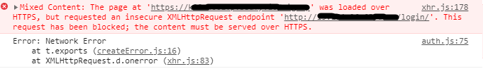
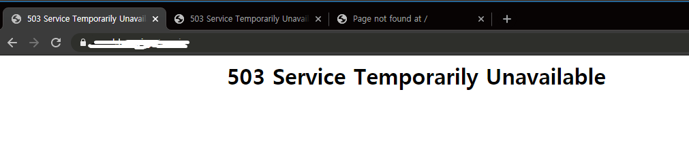

# HTTPS 배포하기

```
1. HTTPS
2. WAS
3. MySQL 설치 및 연결 설정
4. Django 배포
5. Vue 배포 (Front 배포)
6. Nginx 명령어
7. AWS에 Domain 등록 및 ELB 사용하기
```


## 1. HTTPS

- [초보몽키, HTTPS와 SSL 인증서, SSL 동작방법](https://wayhome25.github.io/cs/2018/03/11/ssl-https/)
- [[Deploy] - 서버사이드 HTTPS 환경으로 배포하기(AWS)](https://velog.io/@zeros0623/%EC%84%9C%EB%B2%84%EC%82%AC%EC%9D%B4%EB%93%9C-HTTPS-%ED%99%98%EA%B2%BD%EC%9C%BC%EB%A1%9C-%EB%B0%B0%ED%8F%AC%ED%95%98%EA%B8%B0-ahk4mcv5a4)

### Domain & SSL

- [[AWS의 기본 08] EC2 인스턴스에 도메인 연결 (Route53)](https://wingsnote.com/57)
- [무료도메인과 AWS Certificate Manager(ACM)를 이용해서 SSL 인증서 얻기](https://velog.io/@zeros0623/%EB%AC%B4%EB%A3%8C%EB%8F%84%EB%A9%94%EC%9D%B8%EA%B3%BC-AWS-Certificate-ManagerACM%EB%A5%BC-%EC%9D%B4%EC%9A%A9%ED%95%B4%EC%84%9C-SSL-%EC%9D%B8%EC%A6%9D%EC%84%9C-%EC%96%BB%EA%B8%B0-rdk4meryd4) ✔
- [AWS, 자습서: Amazon Linux 2에서 SSL/TLS 구성](https://docs.aws.amazon.com/ko_kr/AWSEC2/latest/UserGuide/SSL-on-amazon-linux-2.html)

- [certbot 공식](https://certbot.eff.org/lets-encrypt/ubuntuxenial-nginx.html)
- [Ubuntu-Nginx-환경에서-CertBot을-사용하여-https-사용하기](https://velog.io/@pinot/Ubuntu-Nginx-%ED%99%98%EA%B2%BD%EC%97%90%EC%84%9C-CertBot%EC%9D%84-%EC%82%AC%EC%9A%A9%ED%95%98%EC%97%AC-https-%EC%82%AC%EC%9A%A9%ED%95%98%EA%B8%B0) ✔
- [Lets' Encrypt로 무료로 HTTPS 지원하기](https://blog.outsider.ne.kr/1178)
- [Certbot으로 무료 인증서 발급 받기](https://elfinlas.github.io/2018/03/19/certbot-ssl/) ✔
- [무료 SSL 보안 인증서 발급받기 (Free SSL Certificate)](https://apost.kr/327)
- [Nginx SSL]([Nginx] HTTPS (SSL))
- [Serving Django apps behind SSL with Nginx.md](http://nginx.md/https://gist.github.com/davewongillies/6897161)


## 2. WAS

- [WSGI, WAS, CGI 이해](https://brownbears.tistory.com/350)

### uWSGI

- [uwsgi의 역할은?](https://medium.com/@shdotseo/uwsgi%EC%9D%98-%EC%97%AD%ED%99%9C%EC%9D%80-c0ffe2920391)
- [django 와 WSGI 와 NGINX Python](https://crystalcube.co.kr/205)
- [WSGI에 대한 설명, WSGI란 무엇인가?  각 wsgi 특징](https://paphopu.tistory.com/37)
- [[처음부터 시작하는 EC2] nginx와 uwsgi로 django 서비스하기](https://yuddomack.tistory.com/entry/%EC%B2%98%EC%9D%8C%EB%B6%80%ED%84%B0-%EC%8B%9C%EC%9E%91%ED%95%98%EB%8A%94-EC2-nginx%EC%99%80-uwsgi%EB%A1%9C-django-%EC%84%9C%EB%B9%84%EC%8A%A4%ED%95%98%EA%B8%B0)


## 3. MySQL 설치 및 연결 설정

1. [AWS-EC2-Ubuntu-18.04에-Mysql-5.7-설치하기](https://velog.io/@loakick/AWS-EC2-Ubuntu-18.04%EC%97%90-Mysql-5.7-%EC%84%A4%EC%B9%98%ED%95%98%EA%B8%B0)
2. [[EC2] AWS EC2 MySQL 서버를 만들어보자!](https://luji.tistory.com/7)


## 4. Django 배포

### heroku

- [MDN Django 튜토리얼 파트 11: Django 웹사이트 공개하기](https://developer.mozilla.org/ko/docs/Learn/Server-side/Django/Deployment)

### AWS EC2

1. [git 설치](https://ppost.tistory.com/entry/Ubuntu-Ubuntu%EC%97%90-Git-%EC%84%A4%EC%B9%98%ED%95%98%EA%B3%A0-%EC%82%AC%EC%9A%A9%ED%95%98%EA%B8%B0) 

2. [python3.7 및 venv 설치하기](https://softwaree.tistory.com/85)

    ```python
    $ sudo apt-get update
    $ sudo apt-get update -y
    $ sudo apt install build-essential
    $ sudo apt-get install nginx python3.7 python3-venv python3.7-dev default-libmysqlclient-dev

    $ source venv/bin/activate
    (venv)
    $ pip install -r requirements.txt
    ```

3. [mysqlclient error 경우 python dev 등 버전 확인](https://pypi.org/project/mysqlclient/) 

4. ls -l 으로 venv [권한](https://m.blog.naver.com/PostView.nhn?blogId=occidere&logNo=220816793990&proxyReferer=https:%2F%2Fwww.google.com%2F) 확인하기. venv 설치 시 sudo 쓰면 root 로 작동한다.

5. [wsgi.py 에 venv 경로 넣어주기](https://twpower.github.io/49-how-to-use-newrelic-apm-in-pyenv-and-virtualenv)
    - 참고 /home/ubuntu/p

    ```python
    import sys
    sys.path.append('/home/ubuntu/p/venv/lib/python3.7/site-packages')
    ```

6. gunicorn setting 

    - [How To Set Up Django with Postgres, Nginx, and Gunicorn on Ubuntu 16.04](https://www.digitalocean.com/community/tutorials/how-to-set-up-django-with-postgres-nginx-and-gunicorn-on-ubuntu-16-04)

    - /home/ubuntu/p/static
    - 왜 soket 으로 켠 링크로는 안 들어가지는걸까....
    - [수정 참고 링크 - group name 때문 이었던것 같다](https://m.blog.naver.com/monkey5255/221565148698) ✔

    ```
    [Unit]
    Description=gunicorn daemon
    After=network.target
    
    [Service]
    User=ubuntu
    Group=ubuntu
    WorkingDirectory=/home/ubuntu/p
    ExecStart=/home/ubuntu/p/venv/bin/gunicorn --access-logfile - --workers 3 --bind unix:/home/ubuntu/p/p.sock p.wsgi:application
    
    [Install]
    WantedBy=multi-user.target
    ```

7. nginx 설정 변경

   - [proxy headers size 관련](https://computingforgeeks.com/how-to-solve-nginx-warn-could-not-build-optimal-proxy-headers-hash-error/)

   ```
   server {
       listen 80;
   
       location = /favicon.ico { access_log off; log_not_found off; }
       location /static/ {
           root /home/ubuntu/p;
       }
   
   	location / {
           root /home/ubuntu/p;
   	    proxy_headers_hash_max_size 512;
   		proxy_headers_hash_bucket_size 128;
   
           proxy_set_header Host $http_host;
           proxy_set_header X-Real-IP $remote_addr;
           proxy_set_header X-Forwarded-For $proxy_add_x_forwarded_for;
           proxy_set_header X-Forwarded-Proto $scheme;
           proxy_pass http://unix:/home/ubuntu/p/p.sock;
       }
   }
   ```

   - sudo ln -s /etc/nginx/sites-available/p /etc/nginx/sites-enabled

7. [gunicorn daemon 실행](https://velog.io/@devzunky/TIL-no.82-AWS-Django-Server-Deployment)
   - gunicorn p.wsgi:application --bind=0.0.0.0:8000 —daemon
   - 또는 gunicorn.config 를 통해서 실행
   - ps -ef | grep python

8. nginx 문법 테스트 및 실행 확인


## 5. Vue 배포

- [AWS입문(3)-배포 프론트 웹 서버](https://rosejam.github.io/aws/AWS(3)/)
- certbot 설치

    ```python
    $sudo apt-get update
    $sudo apt-get install software-properties-common
    $sudo add-apt-repository universe
    $sudo add-apt-repository ppa:certbot/certbot
    $sudo apt-get update
    ```

- SSL 인증서 발급 방법 (1)

    ```python
    $ sudo certbot certonly --standalone -d domain_name
    ```

    - 발급된 인증서 확인: sudo certbot certificates
- SSL 인증서 발급 방법 (2) - nginx 설정 바로 바꿔버리기

    ```python
    $sudo certbot --nginx -d domain_name
    ```

- 인증서 자동갱신 확인

    ```python
    $sudo certbot renew --dry-run
    ```

- HTTPS 에서 HTTP 로 요청을 보내면 에러가 난다.
    - [혼합 콘텐츠 방지](https://developers.google.com/web/fundamentals/security/prevent-mixed-content/fixing-mixed-content?hl=ko)

        


## 6. Nginx

```python
$ sudo service --status-all | grep nginx
$ ps -ef | grep nginx

# 설정파일 수정의 경우
$ nginx -s reload

# 프로세스를 바로 종료
$ nginx -s stop

# 현재 연결 중인 커넥션이 모두 완료될 때까지 기다린 후 종료
$ nginx -s quit
```

- [nginx bind to 0.0.0.0:80 error 해결하기](https://jootc.com/p/201806261346)


## 7. Domain 구매, ELB 사용하기

- Keyword: AWS, DNS, SSL, EC2, Certificate Manager, Load Balancer, Nginx, Django
- 로드밸런싱이란?
    - [[AWS] 로드밸런싱 알아보기](https://medium.com/harrythegreat/aws-%EB%A1%9C%EB%93%9C%EB%B0%B8%EB%9F%B0%EC%8B%B1-%EC%95%8C%EC%95%84%EB%B3%B4%EA%B8%B0-9fd0955f859e)
    - User → Domain → ELB (https:443) → Nginx (http:80) → Django(http:8000)

- [무료도메인과 AWS Certificate Manager(ACM)를 이용해서 SSL 인증서 얻기](https://velog.io/@zeros0623/%EB%AC%B4%EB%A3%8C%EB%8F%84%EB%A9%94%EC%9D%B8%EA%B3%BC-AWS-Certificate-ManagerACM%EB%A5%BC-%EC%9D%B4%EC%9A%A9%ED%95%B4%EC%84%9C-SSL-%EC%9D%B8%EC%A6%9D%EC%84%9C-%EC%96%BB%EA%B8%B0-rdk4meryd4) ✔
- [[초보자를 위한 AWS 웹구축] 7. ELB 생성하기- classic ELB](https://tech.cloud.nongshim.co.kr/2018/10/16/%EC%B4%88%EB%B3%B4%EC%9E%90%EB%A5%BC-%EC%9C%84%ED%95%9C-aws-%EC%9B%B9%EA%B5%AC%EC%B6%95-7-elb-%EC%83%9D%EC%84%B1%ED%95%98%EA%B8%B0-%EC%9E%91%EC%84%B1%EC%A4%91/)
- [[초보자를 위한 AWS 웹구축] 8. 무료 도메인으로 Route 53 등록 및 ELB 연결](https://tech.cloud.nongshim.co.kr/2018/10/16/%EC%B4%88%EB%B3%B4%EC%9E%90%EB%A5%BC-%EC%9C%84%ED%95%9C-aws-%EC%9B%B9%EA%B5%AC%EC%B6%95-8-%EB%AC%B4%EB%A3%8C-%EB%8F%84%EB%A9%94%EC%9D%B8%EC%9C%BC%EB%A1%9C-route-53-%EB%93%B1%EB%A1%9D-%EB%B0%8F-elb/)

- AWS ELB와 Nginx로 HTTPS 서버 구축하기 : [ELB application 부터 NGINX 설정 변경](https://medium.com/@vdongbin/aws-elb%EC%99%80-nginx%EB%A1%9C-https-%EC%84%9C%EB%B2%84-%EA%B5%AC%EC%B6%95%ED%95%98%EA%B8%B0-736b8c5ee76) ✔

- ELD 사용 영역 설정 오류로 발생한 error
    - [The load balancer generates an HTTP error](https://docs.aws.amazon.com/ko_kr/elasticloadbalancing/latest/application/load-balancer-troubleshooting.html#http-503-issues)
    - [HTTP 503: 서비스 사용 불가](https://docs.aws.amazon.com/elasticloadbalancing/latest/application/load-balancer-troubleshooting.html)
    - [Availability Zones for Your Application Load Balancer](https://docs.aws.amazon.com/elasticloadbalancing/latest/application/load-balancer-subnets.html)

    


