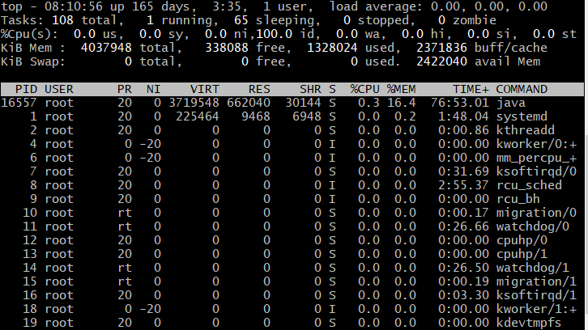
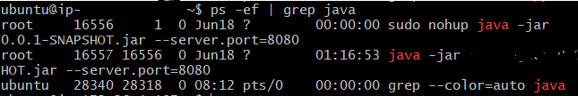
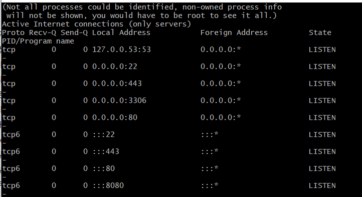

# 배포 때 자주 쓰는 Linux(Ubuntu) 명령어

```
1. process/system
	- top
	- ps
	- kill
		- 좀비 프로세스 찾고 죽이기
	- systemctl 
	- journalctl
	- netstat
2. 파일/폴더 관리
	- mkdir / rmdir
	- pwd
	- cp	
		- 로컬에서 AWS 로 파일 이동하기
	    - AWS 에서 폴더 간 파일 이동하기
	- rm
	- cd
	- ls
```


### 1. Process / system

- `top`

  - 프로세스 목록을 CPU 사용률이 높은 것부터 보여줍니다.

  

- `ps`

  - 현재 실행중인 프로세스를 보여줍니다.
  - `ps aux` CPU, MEM 사용률, 프로세스 상태 코드 등을 확인 할 수 있습니다.
  - `ps -ef` PID 와 PPID 등을 확인할 수 있습니다.

  

- `kill`

  - 프로세스를 종료시킵니다.
  - `kill -9 프로세스아이디` 응답이 없어도 강제 종료시킵니다.
  - 응용🔥 [좀비 프로세스 찾기, 죽이기](https://zetawiki.com/wiki/좀비_프로세스_찾기,_죽이기)

- `systemctl`

  - systemd 시스템, 서비스 매니저를 제어합니다.
  - start, stop, restart, reload, status 등 옵션을 줍니다.
  - `sudo systemctl start nginx`

- `journalctl`

  - 리눅스 로그 등을 조회합니다
  - `sudo journalctl -f`  tail -f 와 동일, 실시간으로 보여줍니다.

- `netstat`

  - 네트워크 접속 상태, 인터페이스의 통계 정보등을 보여줍니다.
  - `netstat -nlpt` 열려있는 포트 확인하기
  - [netstat 명령어를 통한 네트워크 산택 확인 방법](https://blog.naver.com/ncloud24/221388026417)

  


### 2. 파일/폴더 관리

1. `mkdir` / `rmdir`

   - mkdir: 새로운 디렉토리를 만듭니다
   - rmdir: 빈 디렉토리를 삭제합니다. 비어있지 않으면 삭제되지 않습니다.

2. `pwd`

   - 현재 디렉토리의 경로를 확인합니다.
   - 추가: [리눅스 설치 위치, 설치 경로 및 특정 파일 위치 알아내기](https://zetawiki.com/wiki/리눅스_명령어_위치_확인)

3. `cp`

   - 파일 복사 명령어이나, 이를 통해 파일간 이동에도 활용합니다.
   - 옵션
     - -a : 동일하게 복제
     - -i : 파일이 이미 있을 경우 덮어쓸지 물어봅니다.

   - 참고1: [리눅스 안에서 파일 이동 및 복사하기](https://www.manualfactory.net/10805)

     ```
     sudo cp database/user_address.csv /var/lib/mysql/schema_name/user_address.csv
     ```

   - 참고2: `scp` [local 에서 AWS EC2 로 파일 복사하기](https://www.sallys.space/blog/2017/11/28/aws-scp/)

     ```
     scp -i ---.pem dist.zip ubuntu@ip:~/release
     ```

4. `rm`

   - 파일/디렉토리를 삭제합니다.
   - `rm -f` 강제 삭제합니다. 삭제할 것인지 물어보지 않습니다.
   - `rm -r` 디렉토리를 삭제하며, 하위 폴더/파일을 모두 삭제합니다.
   - `rm -rf` -r 과 -f 옵션을 모두 실행합니다.  **되도록 사용하지 않도록 합니다.**  

5. `cd`

   - 디렉토리를 이동 합니다
   - `cd / `  최상위 디렉토리로 이동
   - `cd ..` 상위 디렉토리로 이동
   - `cd ~` 홈 디렉토리로 이동
   - `cd test/` test 디렉토리로 이동
   - `cd ~user` user 계정의 홈 디렉토리로 이동

6. `ls`

   - 디렉토리 내용 목록을 보여줍니다
   - `ls -a`  숨김 파일도 보여줍니다


\+ User 목록 확인하기

- 전체 목록

  ```python
  cat /etc/passwd
  cut -f1 -d: /etc/passwd
  ```

- bash 사용자 목록

  useradd로 계정을 만들면 기본적으로 /bin/bash 환경이 적용된다. bash 사용자 목록이 의미 있는 경우가 많다.

  ```python
  grep /bin/bash /etc/passwd
  grep /bin/bash /etc/passwd | cut -f1 -d:
  ```

