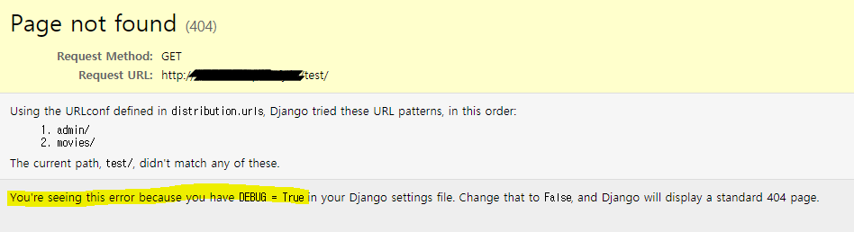
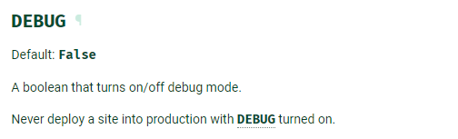
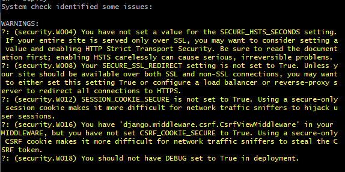
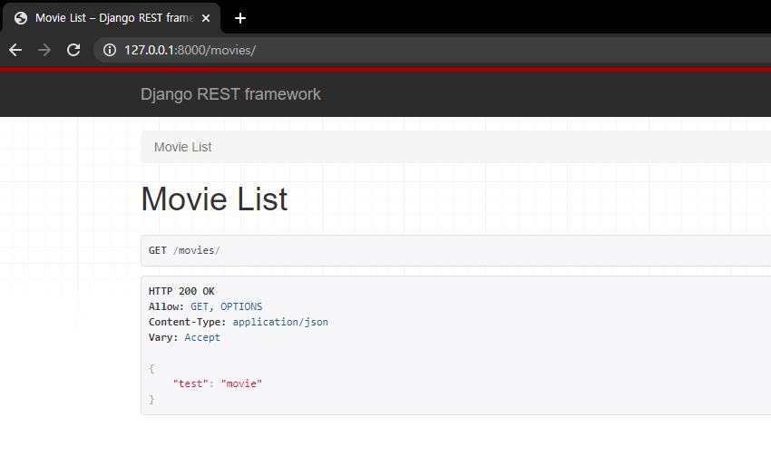
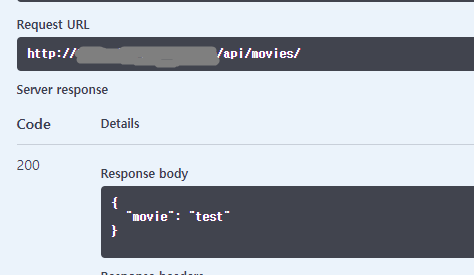
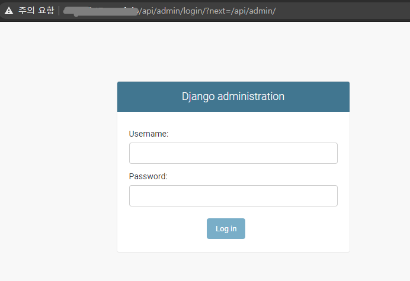
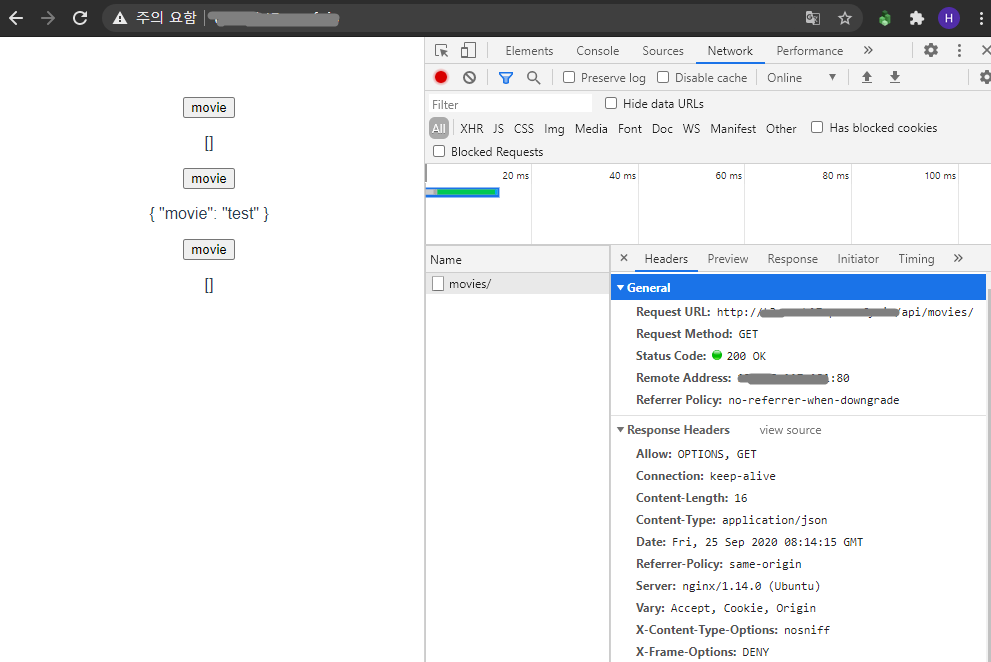

# Django 배포 시 확인 할 점 3가지

> 문서에서는 Nginx 를 사용하고 있습니다.


1. [DEBUG = False](##1.-DEBUG-=-False)
   1. settings.py 에서 개발 모드 여부 확인하기
   2. ALLOWED_HOSTS 설정하기
   3. 설정 값들 환경변수로 분리하기
   4.  manage.py check --deploy
2. [Static files](##2.-Static-files)
   1. collectstatic 
   2. Nginx 경로 설정
   3. 그래도 안 된다면

3. [API rewrite](##3.-API-rewrite)
   1. 80 포트로 들어오는 요청 분리하기
   2. rewrite 설정하기
   3. FORCE_SCRIPT_NAME 설정하기


## 1. DEBUG = False

#### 1. settings.py 에서 개발 모드 여부 확인하기

```python
# settings.py 

# SECURITY WARNING: don't run with debug turned on in production!
DEBUG = True
```

- `Debug = True` 는 말 그대로 개발 모드 입니다! error 내역을 보여주고, 데이터가 어떻게 오가는지까지 보여줍니다. 보안상으로 매우 좋지 않습니다.

   

  

- 공식 문서에서도 `Debug = True` 로 배포하지 말 것을 강조하고 있습니다.

  - [공식문서](https://docs.djangoproject.com/en/3.1/ref/settings/#debug)

  


#### 2. ALLOWED_HOSTS 설정하기

- `Debug = False` 로 변경하는 경우, 모든 요청들이 '400 Bad Request' 처리 될 수 있습니다. settings.py 의 기본 설정이 아래와 같기 때문입니다. 

  ```python
  # settings.py 
  
  ALLOWED_HOSTS = []
  ```

- ALLOWED_HOSTS 는 Django 가 서브할 host와 domain name 을 나열합니다. 

  - [공식문서](https://docs.djangoproject.com/en/3.1/ref/settings/#std:setting-ALLOWED_HOSTS)
  - Debug = True 일 경우 암시적으로  `['.localhost', '127.0.0.1', '[::1]']` 를 host 로 확인합니다.
  - 명시적으로 어떤 호스트를 허용할 것인지 값을 입력해 줍니다.


#### 3. 설정 값들 환경변수로 분리하기

- SECRET_KEY, DATABASE, API KEY 등 환경 변수 또는 파일로 분리하여 관리합니다.

- 단편적인 예로, SECRET_KEY 는 만일 JWT 를 사용 하는 경우 해싱 키로 사용되기도 합니다. 이런 키가 노출되어서는 안 됩니다. 

  ```python
  # settings.py 
  
  SECRET_KEY = 'abcdsfwer123421234avxcdsqer'
  
  JWT_AUTH = {
      'JWT_SECRET_KEY': SECRET_KEY,
      ...
  }
  ```

- 사실 Git 에 올리기 전에 최초에 관련 setting 을 해주는 것이 가장 좋습니다. commit 내역에 SECRET_KEY 들이 올라가기 전에 .env 로 관리해주는 것입니다.


#### 4. manage.py check --deploy

- 이 외에도 어떤 체크 항목들이 있을지 확인할 수 있습니다.




## 2. Static files

- 로컬에서는 예쁘게 잘 되던 백엔드 사이트가

  

- 배포한 주소로 들어가보면 아래와 같이 나오는 경우가 있습니다. (사진은 일단 wsgi 로 실행만 시킨 상태)

  

  - 왜 못생겨졌을까, 로그를 보면 css, js 파일들이 Not Found 라고 뜨는 것을 확인할 수 있습니다. Django 에서 사용 할 static file 들을 못 찾아오고 있는 상태입니다.


#### 1. collectstatic 

1. django 에서 사용하고 있던 정적 파일들을 한 곳으로 모으기 위해 경로를 지정해줍니다.

   - [공식문서](https://docs.djangoproject.com/en/3.1/howto/static-files/#deployment)

   ```python
   # settings.py 
   
   import os
   
   STATIC_ROOT = os.path.join(BASE_DIR, 'static')
   ```

   ```python
   # settings.py django ver.3.1 
   
   STATIC_ROOT = BASE_DIR / 'static'
   ```

   

2. static file 들을 모아줍니다.

   ```shell
   python manage.py collectstatic
   ```


#### 2. Nginx 에 static 경로 설정

1. 요청을 받는 Nginx 가 정적 파일 요청을 처리할 수 있도록 경로를 설정해주어야 합니다. default 파일이나 프로젝트 용으로 만든 .conf 파일을 수정해줍니다. 아래 내용을 자신의 프로젝트에 맞게 수정, 추가합니다.

   ```
         location /static/ {
                   root /home/ubuntu/my_project/project_name;
           }
   ```


#### 3. 혹시 잘 안 된다면

1. urls.py 를 수정해봅니다.

   ```python
   # urls.py
   rom django.urls import path, include, re_path
from django.views.static import serve
   from django.conf import settings
   from django.conf.urls.static import static
   
   urlpatterns = [
       re_path(r'^media/(?P<path>.*)$', serve, {'document_root': settings.MEDIA_ROOT}),
       re_path(r'^static/(?P<path>.*)$', serve,{'document_root': settings.STATIC_ROOT}),
   ]
   ```
   


## 3. API rewrite

> 문서 작성자의 방법입니다. 
>
> 다른 방법이 있을 수 있습니다. 서브 도메인이라거나 포트를 따로 열어버리거나 등등


#### 1. 80 포트로 들어오는 요청 분리하기

- Nginx 에서 프론트와 백의 요청을 분리하기 위해 아래와 같이 작성한 경우가 많을 것 같은데요

  ```bash
  server {
  	listen 80 default_server;
  	listen [::]:80 default_server;
  	
  	root /home/ubuntu/dist;
  	index index.html index.htm;
  	server_name _;
  	
  	location / {
  		try_files $uri $uri/ /index.html;
  	}
  	
  	location /api/ {
  		proxy_pass http://localhost:8000/api/;
  		proxy_redirect off;
  		charset utf-8;
  		
  		proxy_set_header X-Real-IP $remote_addr;
  		proxy_set_header X-Forwarded-For $proxy_add_x_forwarded_for;
  		proxy_set_header Host $http_host;
  		proxy_set_header X-Forwarded-Proto $scheme;
      }
  }
  ```

- Django 의 경우 gunicorn 또는 uWSGI 를 설정하게 되고, 설정마다 경로의 차이가 있겠지만 기본적으로는 아래와 같이 api 부분을 작성하셨을 것 같습니다.

  - gunicorn

    ```
    location /api/ {
    		root /home/ubuntu/project;
    		proxy_pass http://unix:/home/ubuntu/project/distribution.sock;
            }
    ```

  - uWSGI

    ```
    location /api/ {
    		root /home/ubuntu/project;
    
            include uwsgi_params;
            uwsgi_pass unix:/home/ubuntu/project/distribution.sock;
            }
    ```

    

- 그런데, django 에 설정한 url 마다 다를 수 있지만 의도한 바 대로 작동하지 않는 경우가 있을 텐데요.

  예를들어 아래와 같이 url 을 작성했다면 위의 코드 만으로는 의도한 대로 작동하지 않습니다.

  ```python
  # urls.py 
  
  urlpatterns = [
      path('admin/', admin.site.urls),
      path('movie/', include('movies.urls')),
  ]
  ```

- 아래처럼 변경하더라도 admin, swagger 요청 시 의도한 대로 동작하지 않을 수 있습니다.

  ```python
  # urls.py 
  
  urlpatterns = [
      path('api/admin/', admin.site.urls),
      path('api/movie/', include('movies.urls')),
  ]
  ```

  - http://project.io/api/admin 으로 요청을 보낸 것이 갑자기 http://project.io/admin 으로 요청이 가고 404 not found 페이지가 뜬다거나 하는 경우가 있습니다.


#### 2. Nginx 설정 변경

- django urls.py 

  ```python
  urlpatterns = [
      path('admin/', admin.site.urls),
      path('movie/', include('movies.urls')),
  ]
  ```

- 백앤드는 http://project.io/movie/  라는 주소로 요청을 받도록 설계 되어 있습니다.

  하지만, 클라이언트가 보게 될 프론트 페이지와 구분하기 위해서 http://project.io/api/movie/  라는 주소로 요청을 받고자 합니다.

- 이를 위해 `nginx` 에서 http://project.io/api/movie/  주소로 요청을 받고  http://project.io/movie/  라는 이름으로 백엔드로 토스하도록 설정해줍니다.

- /api/ 이후에 있는 주소만 잘라서 요청하겠다는 설정을 추가해줍니다.

  - [참고](https://serverfault.com/questions/534248/nginx-django-suburl-doesnt-work/706742)

  - gunicorn

    ```
    location /api/ {
    		root /home/ubuntu/project;
    		
            rewrite ^/api(/.*)$ $1 break;
            
    		proxy_pass http://unix:/home/ubuntu/project/distribution.sock;
            }
    ```

  - uWSGI

    ```
    location /api/ {
    		root /home/ubuntu/project;
    		
            rewrite ^/api(/.*)$ $1 break;
            
            include uwsgi_params;
            uwsgi_pass unix:/home/ubuntu/project/distribution.sock;
            }
    ```

    

  

#### 3. FORCE_SCRIPT_NAME 설정하기

> admin 페이지의 redirect 문제 해결하기
>
> swagger 가 요청을 보내는 Base URL 설정 간편하게 하기

- [Django 공식문서](https://docs.djangoproject.com/en/3.1/ref/settings/#force-script-name)

- [drf-yasg 공식문서](https://drf-yasg.readthedocs.io/en/stable/settings.html#default-api-url)


- 요청 주소에 대해 값을 override 합니다. Django 의 req/res cycle 바깥에서 요청 주소를 prefix 합니다.
- 간단히 말하면 django 안의 코드와 상관없이, django 로 요청을 보내려면 /api/ 가 달려있게 합니다. 

```python
# settings.py


FORCE_SCRIPT_NAME = '/api'

```


- 잘 동작 하는 것을 확인합니다.










