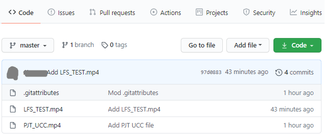

# Git Large File Storage

1. [LFS 란?](##1.-LFS-란?)
   - LFS의 정의
   - 왜 사용하나요?
2. [LFS 사용하기](##2.-LFS-사용하기)
   - 사용방법
   - 주의사항

3. [참고하기 좋은 자료](##3.-참고하기-좋은-자료)


## 1. LFS 란?

#### LFS 의 정의

- Git 에서 대용량 파일도 버전관리 할 수 있도록 도와주는 오픈 소스 프로그램
- 텍스트 파일이 아닌 바이너리 파일(모델링, 오디오, 이미지, 데이터 셋 등)을 github 과 같은 remote server에 따로 업로드하여 관리합니다.


#### 왜 사용하나요?

​	Git 은 텍스트 파일과 같은 형태로 등록한 파일이 변화한 내역을 누적하여 형상관리를 합니다. 즉, Git 자체는 용량이 매우 작습니다! 그리고 Github 에 50MB 가 넘는 파일을 올리려 하면 경고가 뜨며, 100MB 이상의 파일은 올릴 수 없다는 에러가 발생하기도 합니다. 


​                                   error 메세지를 보면 친절하게 LFS 를 사용하라고도 알려줍니다. 


​	프로젝트를 할 때 node modules 같은 폴더는 .gitignore 등록을 통해 git 에 올라가지 않도록 관리합니다. 다시 설치하면 되니깐요. 하지만, 다른 팀원들과 함께 공유하고, 관리해야 하는 파일의 용량이 큰 경우에는? 이때 LFS 를 활용할 수 있습니다. LFS 등록하고 커밋하면 다른 팀원들도 함께 해당 파일의 버전관리를 할 수 있습니다.


## 2. LFS 사용하기

#### 사용방법

1. 공식 사이트에서 다운로드 합니다. 👉 https://git-lfs.github.com/


2. 설치합니다.

   ```bash
   $ git lfs install
   ```


3. LFS 를 사용 할 Git repository 에서 어떤 파일 타입을 LFS 를 통해 관리할 것인지 등록해 줍니다. 최초 등록 시 `.gitattributes` 라는 파일이 생성됩니다. 또는 해당 파일을 직접 생성, 작성 또는 추가 할 수 있습니다.

   ```bash
   $ git lfs track ".mp4"
   ```

   `.gitattributes` 파일을 열면 아래와 같이 작성되어 있습니다. 

   ```
   *.mp4 filter=lfs diff=lfs merge=lfs -text
   ```


4. `.gitattributes` 를 파일을 git 에 등록합니다. 스테이징한 이후로는 .gitattributes 의 변동 사항을 git 이 알아서 트래킹 합니다.

   ```bash
   $ git add .gitattributes
   ```

   

5. 평소에 하듯 add, commit, push 를 진행하면 됩니다.

   - 폴더의 상태 입니다. 영상의 크기가 170MB가 되네요. 

   

   

   - add, commit, push를 하자 LFS 에 파일을 올리고 있다고 알려줍니다.

   

   

   - 잘 올라가네요!!

   

   

   


#### 주의사항

LFS 를 통해 파일을 관리하려면 **Git 이 해당 파일을 tracking 하기 이전에 즉, staging 하기 이전에, 쉬운 말로 `git add ` 하기 이전에!!!** LFS 에 등록해 주어야 합니다.  저는 위에서 용량이 커서 올라가지 않던 commit 을 취소하고 이어서 작업을 진행했습니다.


## 3. 참고하기 좋은 자료

- [Git LFS 공식 문서](https://git-lfs.github.com/)

- [Git LFS (Large File Storage) 사용해보기](https://devlog.github.io/git-lfs/2015/12/09/git-lfs.html)
- [Git lfs를 사용하여 대용량 파일 관리하기](https://rudalson.tistory.com/entry/git-lfslarge-file-storage%EB%A5%BC-%EC%82%AC%EC%9A%A9%ED%95%98%EC%97%AC-%EB%8C%80%EC%9A%A9%EB%9F%89-%ED%8C%8C%EC%9D%BC-%EA%B4%80%EB%A6%AC%ED%95%98%EA%B8%B0)

- Git 에 대한 추가자료: [Git 의 기초 - 수정하고 저장소에 저장하기](https://git-scm.com/book/ko/v2/Git%EC%9D%98-%EA%B8%B0%EC%B4%88-%EC%88%98%EC%A0%95%ED%95%98%EA%B3%A0-%EC%A0%80%EC%9E%A5%EC%86%8C%EC%97%90-%EC%A0%80%EC%9E%A5%ED%95%98%EA%B8%B0)

