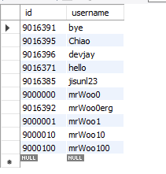

# SQL

> Thanks to @sujinhope and @ghleokim 


[JOIN](###JOIN)

[LIMIT, OFFSET](###LIMIT,-OFFSET)

[ORDER BY](###ORDER_BY-_ASC-/-DESC)

[LIKE](###LIKE)

[DISTINCT](###DISTINCT)

[GROUP BY](###GROUP-BY)

[HAVING](###HAVING)

[BETWEEN](###BETWEEN)

[CASE _ END](###CASE-_-END)

[문자열](###문자열)

[논리 관련 함수](###논리-관련-함수)

[정규 표현식](###정규-표현식)

[날짜관련-함수](###날짜관련-함수)

[변수 사용하기](###변수-사용하기)


### LIMIT, OFFSET

```sql
select id, username from wouldyouci.accounts_user;
```


```sql
select id, username from wouldyouci.accounts_user limit 10;
```


```sql
select id, username from wouldyouci.accounts_user limit 10 offset 4;
```




### ORDER BY _  ASC / DESC 

- 순서 주의! 이름 순 정렬 + 최신순 정렬

```SQL
SELECT ANIMAL_ID, NAME, DATETIME FROM ANIMAL_INS ORDER BY NAME, DATETIME DESC;
```


```sql
select id, username from wouldyouci.accounts_user order by id asc limit 10;
```


```sql
select id, username from wouldyouci.accounts_user order by id desc limit 10;
```


### LIKE

```sql
select id, username from wouldyouci.accounts_user where username LIKE 'mrWoo_';
```


```sql
select id, username from wouldyouci.accounts_user where username LIKE 'mrWoo__';
```


```sql
select id, username from wouldyouci.accounts_user where username LIKE 'mrWoo%';
```


```SQL
SELECT INS.ANIMAL_ID, INS.ANIMAL_TYPE, INS.NAME FROM ANIMAL_INS INS
JOIN ANIMAL_OUTS AS OUTS
ON INS.ANIMAL_ID = OUTS.ANIMAL_ID
WHERE INS.SEX_UPON_INTAKE LIKE 'I%' AND (OUTS.SEX_UPON_OUTCOME LIKE 'S%' OR OUTS.SEX_UPON_OUTCOME LIKE 'N%');
```


### DISTINCT

```sql
select count(distinct is_admin) from wouldyouci.accounts_user;
```

```
2
```


### GROUP BY

- group함수를 Group by절과 함께 사용하면 레코드를 group by절에서 지정한 컬럼의 데이터를 기준으로 분류해서 group을 나눈 후 group함수 적용한다. 
- group함수의 결과는 group의 개수만큼 조회된다. 
- `group by 컬럼명`: group 별 데이터가 조회된다. 
- `group by 컬럼명 with rollup`:  group 별 데이터와 전체(또는 중간)집계 결과가 조회된다.

```sql
SELECT * FROM wouldyouci.movies_movie_genres group by genre_id;
```


```sql
SELECT *, count(genre_id) FROM wouldyouci.movies_movie_genres group by genre_id with rollup;
```


```sql
select id, name, round(score, 1) as score 
from wouldyouci.movies_movie 
group by watch_grade with rollup 
order by score;
```


```sql
select watch_grade from wouldyouci.movies_movie group by watch_grade;
```

```sql
select distinct watch_grade from wouldyouci.movies_movie;
```


```sql
SELECT user_id, count(user_id) FROM wouldyouci.accounts_rating group by user_id;
```

```SQL
SELECT ANIMAL_TYPE, COUNT(ANIMAL_TYPE) AS 'count' 
FROM ANIMAL_INS 
GROUP BY ANIMAL_TYPE 
ORDER BY ANIMAL_TYPE
```


```SQL
SELECT NAME, COUNT(NAME) AS 'COUNT' 
FROM ANIMAL_INS 
GROUP BY NAME 
HAVING COUNT(NAME) > 1 
AND NAME IS NOT NULL 
ORDER BY NAME;
```


### HAVING

- 13 개

```sql
select name, score, watch_grade 
from wouldyouci.movies_movie 
group by watch_grade 
having score > 3;
```

| 정보 없음                         | 5    | 관계자외 출입금지 |
| --------------------------------- | ---- | ----------------- |
| 시네마 천국                       | 4.77 | 전체 관람가       |
| 빽 투 더 퓨쳐                     | 4.78 | 12세 관람가       |
| 스타워즈 에피소드 4 - 새로운 희망 | 3.5  | PG                |
| 다이 하드                         | 5    | 15세 관람가       |
| 셰인                              | 5    | NR                |
| 리썰 웨폰                         | 5    | 청소년 관람불가   |
| 끝없는 사랑                       | 4.33 | R                 |
| 매드 맥스 3                       | 5    | PG-13             |
| 브이 - 5부작 미니시리즈           | 4.5  | 정보없음          |
| 환타지아                          | 4    | G                 |
| 로망스                            | 4    | 제한상영가        |
| 갱 오브 13                        | 5    | X[NC-17]          |

- 16 개

```sql
select name, score, watch_grade from wouldyouci.movies_movie group by watch_grade;
```

| 정보 없음                         | 5    | 관계자외 출입금지 |
| --------------------------------- | ---- | ----------------- |
| 시네마 천국                       | 4.77 | 전체 관람가       |
| 빽 투 더 퓨쳐                     | 4.78 | 12세 관람가       |
| 스타워즈 에피소드 4 - 새로운 희망 | 3.5  | PG                |
| 다이 하드                         | 5    | 15세 관람가       |
| 셰인                              | 5    | NR                |
| 리썰 웨폰                         | 5    | 청소년 관람불가   |
| 끝없는 사랑                       | 4.33 | R                 |
| 매드 맥스 3                       | 5    | PG-13             |
| 브이 - 5부작 미니시리즈           | 4.5  | 정보없음          |
| 환타지아                          | 4    | G                 |
| 로망스                            | 4    | 제한상영가        |
| 이삭줍는 사람들과 나              | 0    |                   |
| 내 어머니                         | 1    | NC-17             |
| 갱 오브 13                        | 5    | X[NC-17]          |
| 우리 주변 씨네마                  | 0    | 청년              |


- where 과 having 차이

```sql
select name, score, count(watch_grade) as count_, watch_grade 
from wouldyouci.movies_movie
group by watch_grade
having score > 3
;
```

| name                              | score | count_ | watch_grade       |
| --------------------------------- | ----- | ------ | ----------------- |
| 정보 없음                         | 5     | 2      | 관계자외 출입금지 |
| 시네마 천국                       | 4.77  | 1281   | 전체 관람가       |
| 빽 투 더 퓨쳐                     | 4.78  | 1838   | 12세 관람가       |
| 스타워즈 에피소드 4 - 새로운 희망 | 3.5   | 60     | PG                |
| 다이 하드                         | 5     | 3387   | 15세 관람가       |
| 셰인                              | 5     | 219    | NR                |
| 리썰 웨폰                         | 5     | 2538   | 청소년 관람불가   |
| 끝없는 사랑                       | 4.33  | 131    | R                 |
| 매드 맥스 3                       | 5     | 73     | PG-13             |
| 브이 - 5부작 미니시리즈           | 4.5   | 896    | 정보없음          |
| 환타지아                          | 4     | 9      | G                 |
| 로망스                            | 4     | 6      | 제한상영가        |
| 갱 오브 13                        | 5     | 1      | X[NC-17]          |


```sql
select name, score, count(watch_grade) as count_, watch_grade 
from wouldyouci.movies_movie
where score < 4.8
group by watch_grade
having score > 3
;
```

| name                              | score | count_ | watch_grade     |
| --------------------------------- | ----- | ------ | --------------- |
| 시네마 천국                       | 4.77  | 891    | 전체 관람가     |
| 빽 투 더 퓨쳐                     | 4.78  | 1421   | 12세 관람가     |
| 스타워즈 에피소드 4 - 새로운 희망 | 3.5   | 34     | PG              |
| 터미네이터                        | 4.32  | 1969   | 청소년 관람불가 |
| 에이리언                          | 4.57  | 2615   | 15세 관람가     |
| 끝없는 사랑                       | 4.33  | 93     | R               |
| 네 멋대로 해라                    | 4     | 118    | NR              |
| 레드 소냐                         | 4.33  | 48     | PG-13           |
| 브이 - 5부작 미니시리즈           | 4.5   | 406    | 정보없음        |
| 환타지아                          | 4     | 3      | G               |
| 로망스                            | 4     | 5      | 제한상영가      |


### BETWEEN

- 된다 -> 107 개

```sql
select id, name, score from wouldyouci.movies_movie where 3.1 < score and score < 3.2;
```

- 안 된다!!!

```sql
select id, name, score from wouldyouci.movies_movie where 3.1 < score < 3.2;
```

- 된다 -> 147 개 
  - 이상, 이하이기 때문

```sql
select id, name, score from wouldyouci.movies_movie where score between 3.1 and 3.2;
```

```sql
select id, name, score from wouldyouci.movies_movie where 3.1 <= score and  score <= 3.2;
```


+

- 0개

```sql
select id, name, score from wouldyouci.movies_movie where score is null;
```

- 155개

```sql
select id, name, score from wouldyouci.movies_movie where score = 0;
```


\+

- 40개

```sql
select id, name, score from wouldyouci.movies_movie where score in (3.1, 3.2);
```


### CASE _ END

```sql
/*
 case ~ when ~ then		: when에 지정된 조건이 참이면 then이 수행됨.
 형식]
	case
		when 조건	then 수행할 값, 연산식
        when ...
        else 주어진 조건이 모두 아닌 경우 수행될 값, 연산식
	end
*/
```


- 원하는 결과가 아님. 조회를 한 다음 정렬을 하고 싶다!


- 문법 오류

  


- 됐다

```mysql
select * from 
    (select id, name, score,
        case
            when round(score)=4 then '4점'
            when round(score)=5 then '5점'
            when round(score)=3 then '3점'
            else '1~2점'
        end as '평점'
    from wouldyouci.movies_movie
    limit 20 offset 200) as t
order by t.score;
```


- order by에서 alias에 공백이 있을 경우는 적용되지 않는다.

```sql
/* [Quiz]
	상품번호, 상품명, 인상전 가격, 인상후 가격을 조회하시오.
    가격 인상은 다음과 같다.
    가격이 10000원 미만이면 15%을 가격을 인상하고 10000원 이상은 10% 가격을 인상하시오.
    인상된 가격을 기준으로 오름차순으로 정렬하시오.
*/

select gno, brand, price as "인상전 가격" -- alias 부여시 공백이 있는 컬럼명은 ""로 표시
	,case 
		when price < 10000 then price*1.15
		when price >= 10000 then price*1.1
	end as upprice
from goods
order by upprice;
```


- 안 됨

```sql
select id, name, score as 'originalscore',
	case
		when round(score)=4 then '4점'
        when round(score)=5 then '5점'
        when round(score)=3 then '3점'
        else '1~2점'
	end as 'new score'
from wouldyouci.movies_movie
order by 'new score'
limit 20 offset 200;
```


- error

```sql
select id, name, score as 'originalscore',
	case
		when round(score)=4 then '4점'
        when round(score)=5 then '5점'
        when round(score)=3 then '3점'
        else '1~2점'
	end as 'new score'
from wouldyouci.movies_movie
order by new score
limit 20 offset 200;
```


```sql
select id, name, score as 'originalscore',
	case
		when round(score)=4 then '4점'
        when round(score)=5 then '5점'
        when round(score)=3 then '3점'
        else '1~2점'
	end as 'newscore'
from wouldyouci.movies_movie
order by newscore
limit 20 offset 200;
```

```sql
select id, name, score as 'originalscore',
	case
		when round(score)=4 then '4점'
        when round(score)=5 then '5점'
        when round(score)=3 then '3점'
        else '1~2점'
	end as 'new score'
from wouldyouci.movies_movie
order by new score
limit 20 offset 200;
```


```SQL
SELECT ANIMAL_ID, NAME, 
    CASE
        WHEN SEX_UPON_INTAKE LIKE 'N%' THEN 'O'
        WHEN SEX_UPON_INTAKE LIKE 'S%' THEN 'O'
        WHEN SEX_UPON_INTAKE LIKE 'I%' THEN 'X'
    END AS '중성화'
FROM ANIMAL_INS
```


### FLOOR, CEIL, ROUND

```sql
select name, score, floor(score), ceil(score), round(score, 1) 
from wouldyouci.movies_movie;
```


### 문자열

- concat

```sql
/*
  [문자열 연결]
   mysql: concat('문자열', '문자열', '문자열', ...)
   기타	: 문자열 || 문자열 || 문자열 ...
*/

select name, concat('영화 명은 ', name) from wouldyouci.movies_movie limit 10;
```


```sql
/*
  [문자열 추출]
  left(column or 문자열, 추출할 개수): 왼쪽부터 지정한 개수까지의 문자열을 추출
  right(column or 문자열, 추출할 개수): 오른쪽부터 지정한 개수까지의 문자열을 추출
  substring(column or 문자, 시작위치, 개수), substr(column or 문자, 시작위치, 개수)
  : 왼쪽의 시작 위치부터 지정한 개수만큼 추출.
    시작 위치는 1부터.
*/

select name, right(name, 2), left(name, 2), substring(name, 2, 3), substr(name, 2, 3) 
from wouldyouci.movies_movie 
limit 10;
```


```sql
-- repeat(column or 문자, 숫자): 지정한 문자열을 지정할 수만큼 반복

select name, repeat(name, 2) from wouldyouci.movies_movie limit 10;
```

| 정보 없음                           | 정보 없음정보 없음                                           |
| ----------------------------------- | ------------------------------------------------------------ |
| 시네마 천국                         | 시네마 천국시네마 천국                                       |
| 빽 투 더 퓨쳐                       | 빽 투 더 퓨쳐빽 투 더 퓨쳐                                   |
| 빽 투 더 퓨쳐 2                     | 빽 투 더 퓨쳐 2빽 투 더 퓨쳐 2                               |
| 빽 투 더 퓨쳐 3                     | 빽 투 더 퓨쳐 3빽 투 더 퓨쳐 3                               |
| 스타워즈 에피소드 4 - 새로운 희망   | 스타워즈 에피소드 4 - 새로운 희망스타워즈 에피소드 4 - 새로운 희망 |
| 스타워즈 에피소드 5 - 제국의 역습   | 스타워즈 에피소드 5 - 제국의 역습스타워즈 에피소드 5 - 제국의 역습 |
| 스타워즈 에피소드 6 - 제다이의 귀환 | 스타워즈 에피소드 6 - 제다이의 귀환스타워즈 에피소드 6 - 제다이의 귀환 |
| 다이 하드                           | 다이 하드다이 하드                                           |
| 킹콩                                | 킹콩킹콩                                                     |


```sql
/* 
	공백 삭제
    rtrim(column or 문자)	: 오른쪽의 공백 삭제
    ltrim(column or 문자)	: 왼쪽의 공백 삭제
    trim(column or 문자)	: 좌우의 공백 삭제
 */
select rtrim('      hello      '), ltrim('      hello      '), trim('      hello      ')
from dual;
```


```sql
-- length()	: 문자열 길이
-- reverse(): 문자열을 거꾸로 표시
-- upper(), ucase()	: 문자열을 대문자로 변환
-- lower(), lcase()	: 문자열을 소문자로 변환

select name_eng, length(name_eng), reverse(name_eng) 
from wouldyouci.movies_movie limit 10;
```

| name_eng                                     | length(name_eng) | reverse(name_eng)                            |
| -------------------------------------------- | ---------------- | -------------------------------------------- |
| 404 Not Found                                | 13               | dnuoF toN 404                                |
| Cinema Paradiso                              | 15               | osidaraP ameniC                              |
| Back To The Future                           | 18               | erutuF ehT oT kcaB                           |
| Back To The Future Part 2                    | 25               | 2 traP erutuF ehT oT kcaB                    |
| Back To The Future Part III                  | 27               | III traP erutuF ehT oT kcaB                  |
| Star Wars                                    | 9                | sraW ratS                                    |
| Star Wars Episode V: The Empire Strikes Back | 44               | kcaB sekirtS eripmE ehT :V edosipE sraW ratS |
| Star Wars: Episode VI: Return Of The Jedi    | 41               | ideJ ehT fO nruteR :IV edosipE :sraW ratS    |
| Die Hard                                     | 8                | draH eiD                                     |
| King Kong                                    | 9                | gnoK gniK                                    |


| name_eng                                     | upper(name_eng)                              | lcase(name_eng)                              |
| -------------------------------------------- | -------------------------------------------- | -------------------------------------------- |
| Cinema Paradiso                              | CINEMA PARADISO                              | cinema paradiso                              |
| Back To The Future                           | BACK TO THE FUTURE                           | back to the future                           |
| Back To The Future Part 2                    | BACK TO THE FUTURE PART 2                    | back to the future part 2                    |
| Back To The Future Part III                  | BACK TO THE FUTURE PART III                  | back to the future part iii                  |
| Star Wars                                    | STAR WARS                                    | star wars                                    |
| Star Wars Episode V: The Empire Strikes Back | STAR WARS EPISODE V: THE EMPIRE STRIKES BACK | star wars episode v: the empire strikes back |
| Star Wars: Episode VI: Return Of The Jedi    | STAR WARS: EPISODE VI: RETURN OF THE JEDI    | star wars: episode vi: return of the jedi    |
| Die Hard                                     | DIE HARD                                     | die hard                                     |
| King Kong                                    | KING KONG                                    | king kong                                    |


### 논리 관련 함수

```sql
/*
    case when ~ then : ANSI Query(표준 쿼리)
    
    if(논리식, 참일 때, 거짓일 때)
    - 논리식이 참이면 참일 때 값을 출력하고 거짓이면 거짓일 때 값을 출력한다.
*/

select name, score, 
	if(score < 3.6, '망한 영화'
		,if(score > 4.5, '그럭저럭'
			, '평타')) as '평가'
from wouldyouci.movies_movie
limit 30 offset 300;
```

| name                     | score | 평가      |
| ------------------------ | ----- | --------- |
| 폴리스 스토리2-구룡의 눈 | 5     | 그럭저럭  |
| 세브린느                 | 5     | 그럭저럭  |
| 황비홍                   | 4.5   | 평타      |
| 황비홍 2 - 남아당자강    | 5     | 그럭저럭  |
| 케이프 피어              | 3     | 망한 영화 |
| 폭풍 속으로              | 3.12  | 망한 영화 |
| 현기증                   | 4.43  | 평타      |


```sql
/*
 상품번호, 상품명, 분류번호 조회
 단, 분류번호가 null인 경우 미분류로 표시
*/
select gno, brand
		,if(cno is null, '미분류', cno) as cno
from goods;

/* ifnull(문자 or column, 대체정보): null인 경우 대체정보로 변환.*/
select gno, brand, ifnull(cno, '미분류') as cno
from goods;
```


```SQL
SELECT ANIMAL_TYPE, IF(NAME IS NULL, 'No name', NAME), SEX_UPON_INTAKE FROM ANIMAL_INS;
```

```SQL
SELECT ANIMAL_TYPE, IFNULL(NAME, 'No name'), SEX_UPON_INTAKE FROM ANIMAL_INS;
```


### 정규 표현식

- [참고](https://codingdog.tistory.com/entry/mysql-regexp-%EB%B3%B5%EC%9E%A1%ED%95%9C-%ED%8C%A8%ED%84%B4-%EB%A7%A4%EC%B9%AD%EC%9D%84-%ED%95%B4-%EB%B4%85%EC%8B%9C%EB%8B%A4)

- 시작과 끝 ^, $

```mysql
select name_eng from wouldyouci.movies_movie where name_eng regexp '^[a]';
```

| Alien                |
| -------------------- |
| Aliens               |
| A Fistful Of Dollars |
| A Better Tomorrow    |
| A Better Tomorrow II |

- 집합 [], 패턴 수 {}

- regexp

```sql
update wouldyouci.movies_movie set name_eng=replace(name_eng, "</b>", "") where name_eng regexp "</b>";
select * from wouldyouci.movies_movie where name_eng regexp "</b>";
```


```SQL
SELECT ANIMAL_ID, NAME FROM ANIMAL_INS 
WHERE ANIMAL_TYPE = 'Dog' AND (NAME LIKE '%EL%' OR NAME LIKE '%el%')
ORDER BY NAME
```


### 날짜관련 함수

```sql
/* 4. 날짜 관련 함수 */
select curdate(), curtime(), now(), sysdate() from dual;

-- 날짜 계산
-- DATE_ADD(날짜, INTERVAL 기준값) ADDDATE(날짜, INTERVAL 기준값) 날짜에서 기준값 만큼 더한다.
-- DATE_SUB(날짜, INTERVAL 기준값) SUBDATE(날짜, INTERVAL 기준값)날짜에서 기준값 만큼 뺀다.
-- 기준값 : YEAR, MONTH, DAY, HOUR, MINUTE, SECOND
select date_add(sysdate(), interval 1 day) from dual;
select ADDDATE(sysdate(), interval 1 day) from dual;

select DATE_SUB(sysdate(), interval 1 day) from dual;


/* DAYOFWEEK(날짜) 날짜의 주별 일자 출력(일요일(1), 월요일(2)..토요일(7))*/
SELECT DAYOFWEEK(SYSDATE())
FROM DUAL;

select curdate() as today
		,case when DAYOFWEEK(SYSDATE()) = 1 then '일요일'
			  when DAYOFWEEK(SYSDATE()) = 2 then '월요일'
              when DAYOFWEEK(SYSDATE()) = 3 then '화요일'
              when DAYOFWEEK(SYSDATE()) = 4 then '수요일'
              when DAYOFWEEK(SYSDATE()) = 5 then '목요일'
              when DAYOFWEEK(SYSDATE()) = 6 then '금요일'
              when DAYOFWEEK(SYSDATE()) = 7 then '토요일'
		end as '요일'
from dual;
        
/* 날짜의 요일을 숫자로 반환하는 WEEKDAY(월요일(0) ~ 일요일(6) 반환 */
select weekday(sysdate())
from dual;

/* 1월 1일부터 해당날짜까지의 날수를 반환하는 DAYOFYEAR!(디데이 계산) */
select dayofyear(sysdate()) from dual;

/* 오늘부터 12월 24일까지 남은 날수 계산 */
select dayofyear('20191129') - dayofyear(sysdate()) as "11.29"
from dual;

/* 날짜의 년, 월, 일, 시, 분, 초를 반환 */
select year(sysdate()), month(sysdate()), dayofmonth(sysdate())
		,hour(sysdate()), minute(sysdate()), second(sysdate())
from dual;

/* 해당 월, 요일의 이름을 반환하는 MONTHNAME / DAYNAME */
select monthname(sysdate()), dayname(sysdate())
from dual;

/* 해당날짜의 분기를 반환해주는 quarter(1~4반환) */
select quarter(sysdate()) from dual;
```

```SQL
SELECT HOUR(DATETIME) AS 'HOUR', COUNT(HOUR(DATETIME)) AS 'COUNT' 
FROM ANIMAL_OUTS 
WHERE HOUR(DATETIME) > 8 AND HOUR(DATETIME) < 20
GROUP BY HOUR(DATETIME) 
ORDER BY HOUR(DATETIME);
```

```SQL
SELECT I.ANIMAL_ID, I.NAME FROM ANIMAL_INS I
JOIN ANIMAL_OUTS O
ON I.ANIMAL_ID = O.ANIMAL_ID
ORDER BY DATEDIFF(I.DATETIME, O.DATETIME)
LIMIT 2;
```

```SQL
SELECT ANIMAL_ID, NAME, DATE_FORMAT(DATETIME, '%Y-%m-%d') AS '날짜'
FROM ANIMAL_INS
ORDER BY ANIMAL_ID
```


### JOIN

- [참고 링크](http://rapapa.net/?p=311)


- INNER JOIN (JOIN)

```sql
SELECT mtm.movie_id, movie.name, mtm.people_id, people.name
from wouldyouci.movies_movie_actors as mtm
inner join wouldyouci.movies_movie as movie
inner join wouldyouci.movies_people as people
on mtm.people_id = people.id and mtm.movie_id = movie.id;
```

| movie_id | name          | people_id | name              |
| -------- | ------------- | --------- | :---------------- |
| 10001    | 시네마 천국   | 3241      | 필립 느와레       |
| 10001    | 시네마 천국   | 4374      | 자크 페렝         |
| 10001    | 시네마 천국   | 6038      | 마르코 레오나르디 |
| 10001    | 시네마 천국   | 47952     | 살바토레 카스치오 |
| 10002    | 빽 투 더 퓨쳐 | 917       | 리 톰슨           |
| 10002    | 빽 투 더 퓨쳐 | 1076      | 마이클 J. 폭스    |
| 10002    | 빽 투 더 퓨쳐 | 4603      | 크리스토퍼 로이드 |
| 10002    | 빽 투 더 퓨쳐 | 5104      | 토머스 F. 윌슨    |
| 10002    | 빽 투 더 퓨쳐 | 8637      | 크리스핀 글로버   |


- wouldyouci 의 경우 아래 둘의 값은 같다.  

```sql
select genre.name, count(genre.id)
FROM wouldyouci.accounts_rating as rating
		join wouldyouci.movies_movie as movie
			on rating.movie_id = movie.id
		join wouldyouci.movies_movie_genres as movie_genre
			on movie_genre.movie_id = movie.id
		join wouldyouci.movies_genre as genre
			on genre.id = movie_genre.genre_id
where rating.user_id = 9000000
group by genre.name
```

```sql
select genre.name, count(genre.id)
FROM wouldyouci.accounts_rating as rating
		left join wouldyouci.movies_movie as movie
			on rating.movie_id = movie.id
		left join wouldyouci.movies_movie_genres as movie_genre
			on movie_genre.movie_id = movie.id
		left join wouldyouci.movies_genre as genre
			on genre.id = movie_genre.genre_id
where rating.user_id = 9000000
group by genre.name
```

| 로맨스 | 1    |
| ------ | ---- |
| 모험   | 5    |
| 코미디 | 2    |
| SF     | 5    |
| 액션   | 8    |
| 판타지 | 5    |
| 가족   | 1    |
| 서부   | 1    |
| 드라마 | 3    |
| 스릴러 | 2    |
| 범죄   | 2    |


```sql
SELECT center.*, address.* 
FROM ttakdae_database.user_center AS center
JOIN ttakdae_database.user_address AS address
ON (center.id=1 and center.id=address.center_id)
```


```sql
UPDATE wouldyouci.movies_movie as movie
	left join (
		select movie_id, round(avg(score), 2) as rating_total 
        FROM wouldyouci.accounts_rating 
        group by movie_id 
        ) as rating on rating.movie_id = movie.id
set movie.score = rating.rating_total
where not rating.rating_total is null
```


```SQL
SELECT OUTS.ANIMAL_ID, OUTS.NAME FROM ANIMAL_OUTS AS OUTS
LEFT JOIN ANIMAL_INS AS INS
ON INS.ANIMAL_ID = OUTS.ANIMAL_ID
WHERE INS.ANIMAL_ID IS NULL
```

```SQL
SELECT INS.ANIMAL_ID, INS.NAME FROM ANIMAL_INS INS
JOIN ANIMAL_OUTS OUTS
ON INS.ANIMAL_ID = OUTS.ANIMAL_ID
WHERE INS.DATETIME > OUTS.DATETIME
ORDER BY INS.DATETIME
```

```SQL
SELECT INS.NAME, INS.DATETIME FROM ANIMAL_INS INS
LEFT JOIN ANIMAL_OUTS OUTS
ON OUTS.ANIMAL_ID = INS.ANIMAL_ID
WHERE OUTS.ANIMAL_ID IS NULL
ORDER BY INS.DATETIME
LIMIT 3;
```


### 변수 사용하기

```sql
SET @x=1;
```

```sql
set @x=-1;
select @x:= @x+1;
```


```sql
SET @hour = -1;
SELECT
	(@hour := @hour + 1) AS 'HOUR',
	(
		SELECT COUNT(DATETIME)
		FROM ANIMAL_OUTS
		WHERE HOUR(DATETIME) = @hour
	) AS 'COUNT'
FROM ANIMAL_OUTS
WHERE @hour < 23;

```


